# Earnings Sentiment Analyzer

A machine learning application that analyzes earnings call sentiment to predict stock price movements using AWS serverless architecture.

## 🎯 Project Overview

This project analyzes quarterly earnings call transcripts to predict stock performance over time. Instead of focusing on immediate market reactions, it examines the sustained impact of management sentiment on stock movements between earnings calls (e.g., March earnings → June performance).

## 🏗️ Architecture

```mermaid
graph TB
    subgraph "Phase 1: Core Infrastructure ✅"
        U1[User] --> FE1[Next.js Frontend<br/>AWS Amplify]
        FE1 --> AG1[API Gateway<br/>v1 Stage]
        AG1 --> L1[Sentiment Lambda]
        AG1 --> L2[Stock Data Lambda]
        AG1 --> L3[Prediction Lambda]
        L1 --> S31[S3: ML Models]
        L2 --> S32[S3: Earnings Data]
        L3 --> S31
        L1 --> D1[DynamoDB: Sentiment Results]
        L2 --> D2[DynamoDB: Earnings Cache]
        L3 --> D3[DynamoDB: Stock Prices]
    end

    subgraph "Phase 2: Earnings Calendar & Automation"
        AG1 --> L4[Scheduled Processing Lambda]
        L4 --> EB1[EventBridge Rules<br/>Daily/Weekly Triggers]
        L4 --> D4[DynamoDB: Earnings Calendar]
        L4 --> D5[DynamoDB: Sentiment History]
        FE1 --> CAL[Calendar Dashboard<br/>Component]
    end

    subgraph "Phase 3: Portfolio Management"
        U2[Authenticated User] --> AUTH[Cognito User Pool]
        AUTH --> FE1
        FE1 --> L5[Portfolio Analysis Lambda]
        L5 --> D6[DynamoDB: User Portfolios]
        L5 --> D7[DynamoDB: User Preferences]
        L5 --> SQS1[SQS: Async Processing]
        SQS1 --> L6[Portfolio Processing Lambda]
        L6 --> SNS1[SNS: Email Notifications]
    end

    subgraph "Phase 4: Advanced Analytics"
        FE1 --> L7[Sector Analysis Lambda]
        L7 --> D8[DynamoDB: Sector Data]
        FE1 --> L8[Model Performance Lambda]
        L8 --> D9[DynamoDB: Model Metrics]
        L8 --> CW1[CloudWatch Metrics]
        AG1 --> L9[Advanced Reporting Lambda]
        L9 --> S33[S3: Report Storage]
    end

    subgraph "External APIs"
        L2 --> API1[Alpha Vantage API<br/>Stock Data]
        L1 --> API2[Earnings Transcript APIs<br/>SEC EDGAR]
    end

    subgraph "State Management"
        TF1[Terraform State<br/>S3 + DynamoDB Lock]
        KMS1[KMS Encryption<br/>State & Data]
    end

    classDef deployed fill:#90EE90,stroke:#333,stroke-width:2px
    classDef planned fill:#FFE4B5,stroke:#333,stroke-width:2px
    classDef external fill:#ADD8E6,stroke:#333,stroke-width:2px

    class U1,FE1,AG1,L1,L2,L3,S31,S32,D1,D2,D3,TF1,KMS1 deployed
    class L4,EB1,D4,D5,CAL planned
    class U2,AUTH,L5,D6,D7,SQS1,L6,SNS1 planned
    class L7,D8,L8,D9,CW1,L9,S33 planned
    class API1,API2 external
```



## 📊 Deployment Status

### ✅ Phase 1: Core Infrastructure (DEPLOYED)

- **Frontend**: Next.js app ready for Amplify deployment
- **API Gateway**: `https://9amxu5wdjf.execute-api.us-east-1.amazonaws.com/v1`
- **Lambda Functions**: 3 functions with placeholder code
- **Storage**: S3 buckets and DynamoDB tables configured
- **Security**: IAM roles, encryption, and access controls

### 🚧 Phase 2: Earnings Calendar & Automation (PLANNED)

- **Scheduled Processing**: EventBridge + Lambda for daily earnings analysis
- **Calendar Dashboard**: Interactive earnings calendar UI
- **Batch Processing**: Automated sentiment analysis for multiple stocks
- **Historical Tracking**: Long-term sentiment trend storage

### 🔮 Phase 3: Portfolio Management (PLANNED)

- **User Authentication**: Cognito for user management
- **Portfolio Analysis**: Personal portfolio sentiment scoring
- **Async Processing**: SQS for handling large portfolio analysis
- **Notifications**: SNS for sentiment alerts and recommendations

### 🎯 Phase 4: Advanced Analytics (PLANNED)

- **Sector Analysis**: Industry-wide sentiment trends
- **Performance Tracking**: Model accuracy and improvement metrics
- **Advanced Reporting**: Comprehensive market intelligence reports
- **Business Intelligence**: Professional-grade analytics dashboards

## 🚀 Quick Start

### Prerequisites

- AWS CLI configured
- Terraform >= 1.0
- Node.js >= 18
- Python >= 3.11

### 1. Clone and Setup

```bash
git clone <your-repo>
cd earnings-sentiment-analyzer
cp .env.example .env
# Fill in your .env values (see Environment Variables section)
```

### 2. Deploy Infrastructure

```bash
# Deploy Terraform state management (one-time)
cd terraform-state
terraform init
terraform plan
terraform apply

# Deploy main infrastructure
cd ../terraform
terraform init -backend-config="environments/dev-backend.conf"
terraform plan -var-file="environments/dev.tfvars"
terraform apply -var-file="environments/dev.tfvars"
```

### 3. Local Development

```bash
# Setup local environment
./scripts/local-setup.sh

# Start services
docker-compose up -d

# Development URLs:
# Frontend: http://localhost:3000
# Backend: http://localhost:8000
# DynamoDB Admin: http://localhost:8002
```

## 🔧 Environment Variables

Update your `.env` file with these values:

```bash
# AWS Credentials
AWS_ACCESS_KEY_ID="your-aws-access-key"
AWS_SECRET_ACCESS_KEY="your-aws-secret-key"

# Infrastructure (from Terraform outputs)
TF_STATE_BUCKET="earnings-sentiment-terraform-state-your-account-id"
DEV_API_URL="get-from-output"
ML_MODELS_BUCKET="get-from-output"
EARNINGS_DATA_BUCKET="get-from-output"

# Required API Keys
ALPHA_VANTAGE_API_KEY="get-from-alphavantage.co"

# Amplify (when deployed)
AMPLIFY_APP_ID_DEV="your-amplify-app-id"
```

## 🛠️ Tech Stack

**Frontend:**

- **Next.js 14** with TypeScript
- **Tailwind CSS** for styling
- **Recharts** for data visualization
- **AWS Amplify** for hosting

**Backend:**

- **Python 3.12** with FastAPI
- **AWS Lambda** for serverless compute
- **API Gateway** for REST API
- **DynamoDB** for NoSQL storage
- **S3** for file storage

**Infrastructure:**

- **Terraform** for Infrastructure as Code
- **GitHub Actions** for CI/CD
- **Docker** for local development
- **AWS** for cloud services

**ML/Data:**

- **scikit-learn** for sentiment analysis
- **pandas/numpy** for data processing
- **Alpha Vantage API** for stock data
- **SEC EDGAR** for earnings transcripts

## 📁 Project Structure

``` bash
earnings-sentiment-analyzer/
├── frontend/                 # Next.js application
│   ├── src/
│   ├── package.json
│   └── amplify.yml
├── backend/                  # Python FastAPI
│   ├── src/
│   ├── models/
│   ├── requirements.txt
│   └── Dockerfile
├── terraform/               # Infrastructure as Code
│   ├── environments/
│   ├── *.tf files
│   └── terraform.tfvars
├── terraform-state/         # State management
├── scripts/                 # Deployment scripts
├── .github/workflows/       # CI/CD pipelines
└── docker-compose.yml      # Local development
```

## 🔄 Development Workflow

### Phase 1 Development (Current)

1. **Single Stock Analysis**: Build sentiment analysis for individual stocks
2. **Data Pipeline**: Create ML model training and inference pipelines
3. **Frontend UI**: Develop stock lookup and results dashboard
4. **Testing**: Unit tests and integration tests for core functionality

### Upcoming Phases

Each phase builds incrementally on the previous infrastructure, adding new capabilities without disrupting existing functionality.

## 📈 API Endpoints

### Phase 1 Endpoints (Available)

- `POST /sentiment` - Analyze earnings transcript sentiment
- `GET /stock/{symbol}` - Fetch stock data and recent earnings
- `POST /prediction` - Generate stock performance predictions
- `GET /health` - Service health check

### Future Endpoints (Planned)

- `GET /calendar` - Earnings calendar with sentiment indicators
- `POST /portfolio` - Portfolio sentiment analysis
- `GET /sectors` - Sector-wide sentiment trends
- `GET /reports` - Advanced analytics reports

## 🔐 Security & Compliance

- **Encryption**: All data encrypted at rest and in transit
- **IAM**: Least-privilege access controls
- **VPC**: Network isolation for sensitive operations
- **Monitoring**: CloudWatch logging and alerting
- **Backup**: Point-in-time recovery for all databases

## 💰 Cost Optimization

**Current (Phase 1) - Development:**

- Estimated cost: $10-20/month
- Pay-per-request pricing for low usage
- 14-day log retention to minimize storage costs

**Production Scaling:**

- Auto-scaling based on demand
- Reserved capacity for predictable workloads
- Lifecycle policies for data archival

## 🤝 Contributing

1. Fork the repository
2. Create a feature branch (`git checkout -b feature/amazing-feature`)
3. Commit your changes (`git commit -m 'Add amazing feature'`)
4. Push to the branch (`git push origin feature/amazing-feature`)
5. Open a Pull Request

## 📄 License

This project is licensed under the MIT License - see the [LICENSE](LICENSE) file for details.

## 🙏 Acknowledgments

- **Alpha Vantage** for stock market data API
- **AWS** for serverless infrastructure
- **Terraform** for infrastructure automation
- **Next.js** team for the excellent frontend framework

---

## Built with ❤️ for learning ML in production environments
