# Earnings Sentiment Analyzer

A machine learning application that analyzes earnings call sentiment to predict stock price movements using AWS containerized architecture.

## 🎯 Project Overview

This project analyzes quarterly earnings call transcripts to predict stock performance over time. Instead of focusing on immediate market reactions, it examines the sustained impact of management sentiment on stock movements between earnings calls (e.g., March earnings → June performance).

## Landing Page

[**Live Demo**](https://nextjs-app-alb-1686302174.us-east-1.elb.amazonaws.com/)


## 🏗️ Architecture

### Current Implementation (Phase 1)

```mermaid
graph LR
    User[👤 User] --> ALB[⚖️ Application Load Balancer]
    ALB --> ECS[🐳 ECS Fargate<br/>Next.js Frontend]
    ECS --> API[🔌 API Gateway]
    API --> Lambda1[⚡ Sentiment Analysis]
    API --> Lambda2[📈 Stock Data]
    API --> Lambda3[🤖 Price Prediction]

    Lambda1 --> S3[📦 S3: ML Models]
    Lambda2 --> DynamoDB1[🗄️ DynamoDB: Cache]
    Lambda3 --> DynamoDB2[🗄️ DynamoDB: Results]

    Lambda2 --> AlphaVantage[📊 Alpha Vantage API]
    Lambda1 --> SEC[🏛️ SEC EDGAR API]
    
    ECS --> ECR[🏗️ ECR: Container Registry]
```



### Planned Features (Phases 2-4)

```mermaid
graph TB
    subgraph "Phase 2: Automation"
        Calendar[📅 Earnings Calendar]
        Scheduler[⏰ Scheduled Processing]
        EventBridge[📡 EventBridge]
    end

    subgraph "Phase 3: User Management"
        Auth[🔐 Cognito Auth]
        Portfolio[💼 Portfolio Tracking]
        Notifications[📧 Email Alerts]
    end

    subgraph "Phase 4: Analytics"
        Sectors[🏭 Sector Analysis]
        ModelPerf[📊 Model Performance]
        Reports[📄 Advanced Reports]
    end
```



### Tech Stack

- **Frontend**: Next.js 15, React 19, Tailwind CSS
- **Container**: Docker, ECS Fargate, ECR
- **Backend**: AWS Lambda, API Gateway, DynamoDB
- **ML**: Python, scikit-learn, sentiment analysis models
- **Infrastructure**: Terraform, Application Load Balancer
- **APIs**: Alpha Vantage (stock data), SEC EDGAR (earnings)

## 📊 Deployment Status

### ✅ Phase 1: Core Infrastructure (DEPLOYED)

- **Frontend**: Next.js app containerized and deployed on ECS Fargate
- **Container Registry**: ECR repository for Docker images
- **Load Balancer**: ALB with SSL termination and health checks
- **Auto Scaling**: ECS service with automatic scaling policies
- **API Gateway**: API Gateway deployed
- **Lambda Functions**: 3 functions with placeholder code
- **Storage**: S3 buckets and DynamoDB tables configured
- **Security**: IAM roles, encryption, and access controls

### 🚧 Phase 2: Earnings Calendar & Automation (PLANNED)

- **Scheduled Processing**: EventBridge + Lambda for daily earnings analysis
- **Calendar Dashboard**: Interactive earnings calendar UI
- **Batch Processing**: Automated sentiment analysis for multiple stocks
- **Historical Tracking**: Long-term sentiment trend storage

### 🔮 Phase 3: Portfolio Management (PLANNED)

- **User Authentication**: Cognito for user management
- **Portfolio Analysis**: Personal portfolio sentiment scoring
- **Async Processing**: SQS for handling large portfolio analysis
- **Notifications**: SNS for sentiment alerts and recommendations

### 🎯 Phase 4: Advanced Analytics (PLANNED)

- **Sector Analysis**: Industry-wide sentiment trends
- **Performance Tracking**: Model accuracy and improvement metrics
- **Advanced Reporting**: Comprehensive market intelligence reports
- **Business Intelligence**: Professional-grade analytics dashboards

## 🚀 Quick Start

### Prerequisites

- AWS CLI configured
- Docker Desktop
- Terraform >= 1.0
- Node.js >= 18
- Python >= 3.11

### 1. Clone and Setup

```bash
git clone <your-repo>
cd earnings-sentiment-analyzer
cp .env.example .env
# Fill in your .env values (see Environment Variables section)
```

### 2. Deploy Infrastructure

```bash
# Deploy Terraform state management (one-time)
cd terraform-state
terraform init
terraform plan
terraform apply

# Deploy main infrastructure
cd ../terraform
terraform init -backend-config="environments/dev-backend.conf"
terraform plan -var-file="environments/dev.tfvars"
terraform apply -var-file="environments/dev.tfvars"
```

### 3. Deploy Application

```bash
# Build and push Docker image
cd frontend
docker build -t earnings-sentiment-frontend .
docker tag earnings-sentiment-frontend:latest <account-id>.dkr.ecr.us-east-1.amazonaws.com/nextjs-app:latest
docker push <account-id>.dkr.ecr.us-east-1.amazonaws.com/nextjs-app:latest

# Deploy using GitHub Actions (recommended)
git push origin main  # Triggers CI/CD pipeline
```

### 4. Local Development

```bash
# Setup local environment
./scripts/local-setup.sh

# Start services
docker-compose up -d

# Development URLs:
# Frontend: http://localhost:3000
# Backend: http://localhost:8000
# DynamoDB Admin: http://localhost:8002
```

## 🔧 Environment Variables

Update your `.env` file with these values:

```bash
# AWS Credentials
AWS_ACCESS_KEY_ID="your-aws-access-key"
AWS_SECRET_ACCESS_KEY="your-aws-secret-key"

# Infrastructure (from Terraform outputs)
TF_STATE_BUCKET="earnings-sentiment-terraform-state-your-account-id"
DEV_API_URL="get-from-output"
ML_MODELS_BUCKET="get-from-output"
EARNINGS_DATA_BUCKET="get-from-output"

# Container Registry
ECR_REPOSITORY="nextjs-app"
ECR_REGISTRY="<account-id>.dkr.ecr.us-east-1.amazonaws.com"

# ECS Configuration
ECS_CLUSTER="nextjs-app-cluster"
ECS_SERVICE="nextjs-app-service"
ECS_TASK_DEFINITION="nextjs-app-task"

# Required API Keys
ALPHA_VANTAGE_API_KEY="get-from-alphavantage.co"

# Load Balancer (from Terraform output)
ALB_DNS_NAME="get-from-terraform-output"
```

## 🛠️ Tech Stack

**Frontend:**

- **Next.js 15** with TypeScript
- **Tailwind CSS** for styling
- **Recharts** for data visualization
- **Docker** for containerization
- **ECS Fargate** for hosting

**Backend:**

- **Python 3.12** with FastAPI
- **AWS Lambda** for serverless compute
- **API Gateway** for REST API
- **DynamoDB** for NoSQL storage
- **S3** for file storage

**Infrastructure:**

- **Terraform** for Infrastructure as Code
- **GitHub Actions** for CI/CD
- **Docker** for containerization
- **AWS ECS Fargate** for container orchestration
- **Application Load Balancer** for traffic distribution
- **ECR** for container registry

**ML/Data:**

- **scikit-learn** for sentiment analysis
- **pandas/numpy** for data processing
- **Alpha Vantage API** for stock data
- **SEC EDGAR** for earnings transcripts

## 📁 Project Structure

```bash
earnings-sentiment-analyzer/
├── frontend/                 # Next.js application
│   ├── src/
│   ├── package.json
│   ├── Dockerfile
│   └── .dockerignore
├── backend/                  # Python FastAPI
│   ├── src/
│   ├── models/
│   ├── requirements.txt
│   └── Dockerfile
├── terraform/               # Infrastructure as Code
│   ├── environments/
│   ├── *.tf files
│   └── terraform.tfvars
├── terraform-state/         # State management
├── scripts/                 # Deployment scripts
├── .github/workflows/       # CI/CD pipelines
└── docker-compose.yml      # Local development
```

## 🔄 Development Workflow

### CI/CD Pipeline

The project uses GitHub Actions for automated deployment:

1. **Code Push**: Developer pushes to `main` branch
2. **Build**: Docker image built from Next.js application
3. **Test**: Run unit tests and linting
4. **Push**: Image pushed to ECR registry
5. **Deploy**: ECS service updated with new image
6. **Health Check**: ALB verifies application health

### Phase 1 Development (Current)

1. **Single Stock Analysis**: Build sentiment analysis for individual stocks
2. **Data Pipeline**: Create ML model training and inference pipelines
3. **Frontend UI**: Develop stock lookup and results dashboard
4. **Testing**: Unit tests and integration tests for core functionality

### Upcoming Phases

Each phase builds incrementally on the previous infrastructure, adding new capabilities without disrupting existing functionality.

## 📈 API Endpoints

### Phase 1 Endpoints (Available)

- `POST /sentiment` - Analyze earnings transcript sentiment
- `GET /stock/{symbol}` - Fetch stock data and recent earnings
- `POST /prediction` - Generate stock performance predictions
- `GET /health` - Service health check (used by ALB)

### Future Endpoints (Planned)

- `GET /calendar` - Earnings calendar with sentiment indicators
- `POST /portfolio` - Portfolio sentiment analysis
- `GET /sectors` - Sector-wide sentiment trends
- `GET /reports` - Advanced analytics reports

## 🐳 Container Configuration

### Dockerfile Optimization

The application uses a multi-stage Docker build for optimal image size:

```dockerfile
# Production image optimizations:
- Multi-stage build with separate deps and builder stages
- Node.js 20 Alpine base image
- Standalone output for minimal runtime
- Non-root user for security
- Health checks for ECS integration
```

### ECS Service Configuration

- **Fargate**: Serverless container execution
- **Auto Scaling**: 1-10 tasks based on CPU/memory
- **Health Checks**: ALB monitors `/api/health` endpoint
- **Rolling Updates**: Zero-downtime deployments
- **Service Discovery**: Internal DNS for service communication

## 🔐 Security & Compliance

- **Encryption**: All data encrypted at rest and in transit
- **IAM**: Least-privilege access controls for ECS tasks
- **VPC**: Private subnets for ECS tasks, public for ALB
- **Security Groups**: Restrictive network access rules
- **Container Security**: Non-root user, minimal base image
- **Monitoring**: CloudWatch logging and alerting
- **Backup**: Point-in-time recovery for all databases

## 💰 Cost Optimization

**Current (Phase 1) - Development:**

- Estimated cost: $15-30/month
- ECS Fargate pricing: ~$0.04048/vCPU/hour + $0.004445/GB/hour
- ALB: $16.20/month + $0.008/LCU-hour
- ECR: $0.10/GB/month for storage

**Production Scaling:**

- Auto-scaling based on demand (1-10 tasks)
- Spot capacity for cost savings on non-critical workloads
- Reserved capacity for predictable workloads
- Lifecycle policies for ECR image cleanup

## 🚀 Deployment Optimization

### Fast Deployments

For rapid iteration during development:

```bash
# Optimized deployment configuration
- minimumHealthyPercent: 50% (faster task replacement)
- maximumPercent: 200% (parallel deployments)
- Health check intervals: 10s (faster health detection)
- Docker layer caching for faster builds
```

### Health Check Endpoint

The application includes a health check endpoint for ECS:

```typescript
// /api/health endpoint returns:
{
  "status": "healthy",
  "timestamp": "2025-06-16T...",
  "uptime": 42.5
}
```

## 🤝 Contributing

1. Fork the repository
2. Create a feature branch (`git checkout -b feature/amazing-feature`)
3. Commit your changes (`git commit -m 'Add amazing feature'`)
4. Push to the branch (`git push origin feature/amazing-feature`)
5. Open a Pull Request

## 📄 License

This project is licensed under the MIT License - see the [LICENSE](LICENSE) file for details.

## 🙏 Acknowledgments

- **Alpha Vantage** for stock market data API
- **AWS** for containerized infrastructure
- **Docker** for containerization platform
- **Terraform** for infrastructure automation
- **Next.js** team for the excellent frontend framework

---

## Built with ❤️ for learning ML in production environments
